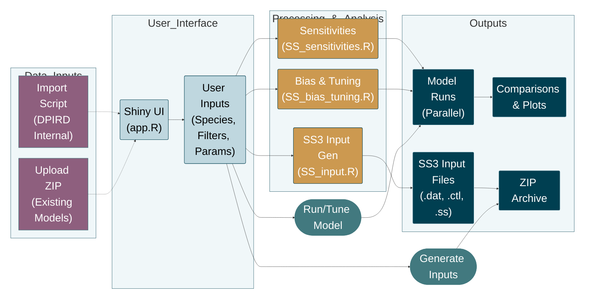

# Shiny-FishAssess: Fisheries Stock Assessment Prep Tool

[](https://shiny.rstudio.com/)  
[](https://www.r-project.org/)  
[](https://opensource.org/licenses/MIT)

**Shiny-FishAssess** is an R Shiny application designed to streamline the preparation of input data for fisheries stock assessments. It provides a user-friendly interface to explore, filter, and compile essential data, generate SS3 input files, and perform advanced model diagnostics including sensitivity analyses, bias tuning, and model comparisons.

## Key Features

* **Data Exploration:** Interactive dashboards for visualising and filtering catch, indices, length, and age data.
* **Species Selection:** Select and focus on specific species using searchable dropdown menus.
* **Assessment Inputs:** Control which data types (Catch, Indices, Length, Age) and parameters (Biological, Fishery) to include.
* **Parameter Specification:** Customise biological and fishery parameters, including time-varying growth/selectivity, natural mortality, and recruitment deviations.
* **SS3 Input Generation:** Automatically generate formatted `datafile.dat`, `controlfile.ctl`, `starter.ss`, and `forecast.ss` files.
* **Sensitivity Analysis:** Run parallelised sensitivity tests including Jitter analysis, Retrospective analysis, and Likelihood profiles ($R_0$, $M$, $h$, Depletion).
* **Bias & Tuning:** Automated tools for bias ramp adjustment and composition weighting (Francis and Dirichlet methods).
* **Model Comparison:** Compare multiple model runs with generated plots and summaries.
* **Parallel Processing:** Leverages multiple cores for efficient batch processing of SS3 models.
* **DPIRD Styling:** Custom plot outputs tailored for reporting.

## Application Files

The repository includes the following key R scripts:

* `app.R`: The main Shiny application script containing UI and server logic.
* `SS_input.R`: Script to format and generate SS3 input files from the processed data.
* `SS_sensitivities.R`: Script to run sensitivity analyses (Jitter, Retro, Profiles) in parallel.
* `SS_bias_tuning.R`: Script handling automated bias adjustment and data weighting.
* `BiolTable.R`: Script to generate the biological parameters table.
* `SSplotComparisonsREP.R`: Helper script for generating model comparison plots.
* `import_DPIRD_data.R`: **(Internal Only)** Script for importing raw database data, available only to DPIRD staff. *Note: As this file is not part of the public repository, the app defaults to "Restricted Mode," which focuses on analysing and manipulating existing SS3 model outputs.*

## Setup and Usage

1.  **Prerequisites:**
    Ensure you have R (>= 4.2.0) and RStudio installed. You will need the following packages:
    ```r
    install.packages(c("shiny", "shinyWidgets", "shinyjs", "shinyFiles", "bslib", 
                       "dplyr", "ggplot2", "tidyr", "data.table", "stringr", 
                       "doParallel", "foreach", "processx", "fs", "zip", 
                       "DT", "kableExtra", "remotes"))
    
    # Install r4ss from GitHub
    remotes::install_github("r4ss/r4ss")
    ```

2.  **Installation:**
    * Clone or download this repository.
    * Place the `Stock_Synthesis_latest/ss.exe` executable in the project root if you intend to run models locally.

3.  **Running the App:**
    * Open `app.R` in RStudio.
    * Run using `shiny::runApp()` or the "Run App" button.
    * **Note:** For best performance, use the "Run External" option in RStudio.

4.  **Workflow:**
    * **Restricted Mode (Public Users):** Upon launch, the app will detect that the data import script is missing. The app will focus on the **SS3 Sensitivity Analysis** and **Bias and Tuning** tabs. You can upload existing SS3 model folders (zipped) to perform diagnostics, comparisons, and tuning.
    * **Full Mode (DPIRD Staff):** With the internal data script present, users can load raw data, filter species/fleets, and generate new SS3 input files from scratch via the "Data Preparation" tabs.

## Process Flowchart

