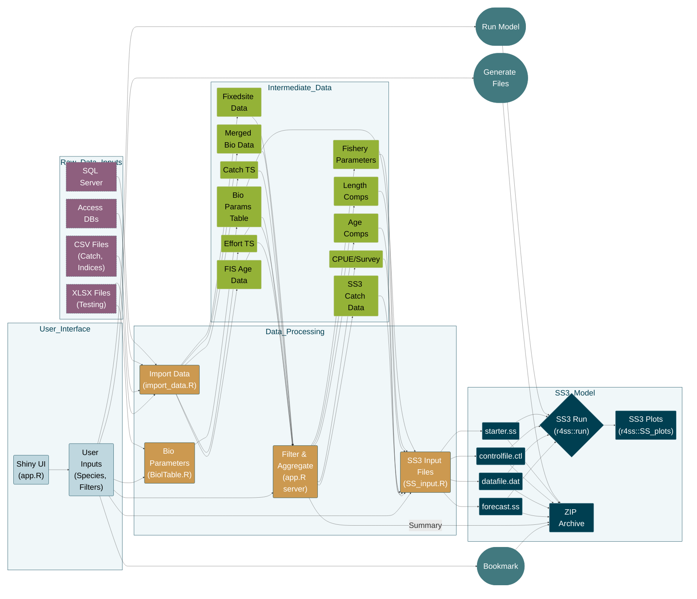

# Shiny-FishAssess: Fisheries Stock Assessment Prep Tool

[](https://shiny.rstudio.com/)  
[](https://www.r-project.org/)  
[](https://opensource.org/licenses/MIT)

**Shiny-FishAssess** is a R Shiny application designed to streamline the preparation of input data for fisheries stock assessments. It provides a user-friendly interface to explore, filter, and compile essential data from various sources, facilitating the creation of input files for stock assessment models like SS3.

## Key Features

* **Data Exploration:** Interactive dashboards for visualizing and filtering catch, indices, length, and age data.
* **Species Selection:** Easily select and focus on specific species using searchable dropdown menus.
* **Data Inclusion Control:** Choose which data types (Catch, Indices, Length, Age, Biological Parameters, Fishery Parameters) to include in the analysis.
* **Parameter Specification:** Define or customize biological and fishery parameters, such as natural mortality, steepness, and initial recruitment.
* **SS3 Input Generation:** Automatically generate formatted input files for the SS3 stock assessment model.
* **Data Download:** Download processed data and configurations in a convenient ZIP archive.
* **Console Output:** Monitor processing steps and any warnings or errors via an integrated console log.

## Application Files

The repository includes the following R scripts:

* `app.R`:  The main Shiny application script, defining the user interface and server logic.
* `import_data.R`:  Script for importing and preprocessing raw data from various sources (e.g., databases, CSV files).
* `BiolTable.R`: Script to generate the biological parameters table.
* `SS_input.R`:  Script to format and generate SS3 input files from the processed data.
* `SS3_sensitivities.R`:  Script to run run sensitivity analyses

## Data Sources

The application integrates data from several sources, including:

* Fixed Site Survey data (Kimberley)
* Pilbara and Kimberley biological databases
* WCD database
* Catch time-series data
* Indices time-series data
* Biological Unit Parameters database 

## Setup and Usage

1.  **Prerequisites:**
    * R (>= 4.2.0)
    * RStudio (recommended)
    * r4ss: Installed from GitHub: 
    
```S
remotes::install_github("r4ss/r4ss")
```

2.  **Installation:**
    * Clone or download the repository to your local machine.
    * Place the necessary data files in the appropriate directories as expected by the R scripts.
    * Ensure all the required R packages are installed.
        
    
3.  **Running the App:**
    * Open the `app.R` script in RStudio (or your preferred R environment).
    * Run the application using the `shiny::runApp()` function or the "Run App" button in RStudio.
    * Recommend using the "`Run External`" option within the "`Run App`" button 

4.  **Workflow:**
    * Use the sidebar panel to select the species, data types, and parameters for your assessment.
    * Explore the data in the main panel's tabs (Catch, Indices, Length, Age, etc.).
    * Adjust parameters and filtering options as needed.
    * Click the "Generate SS3 Files" button to generate and download the SS3 input files and a summary of your selections.

## SS3 Input Files

The application generates the following files for use with the SS3 stock assessment model:

* `datafile.dat`:  The main data file containing catch, indices, and biological information.
* `controlfile.ctl`:  The control file specifying model settings and parameters.
* `starter.ss`:   The SS3 starter file.
* `forecast.ss`:  The forecast file for future projections.

## Important Notes

* Ensure that your data files are correctly formatted and located as expected by the `import_data.R` script.
* Carefully review the console output for any warnings or errors during data processing.
* This tool is designed to aid in data preparation; users are responsible for the validity and appropriateness of the data and assessment settings.

## Process flowchart


